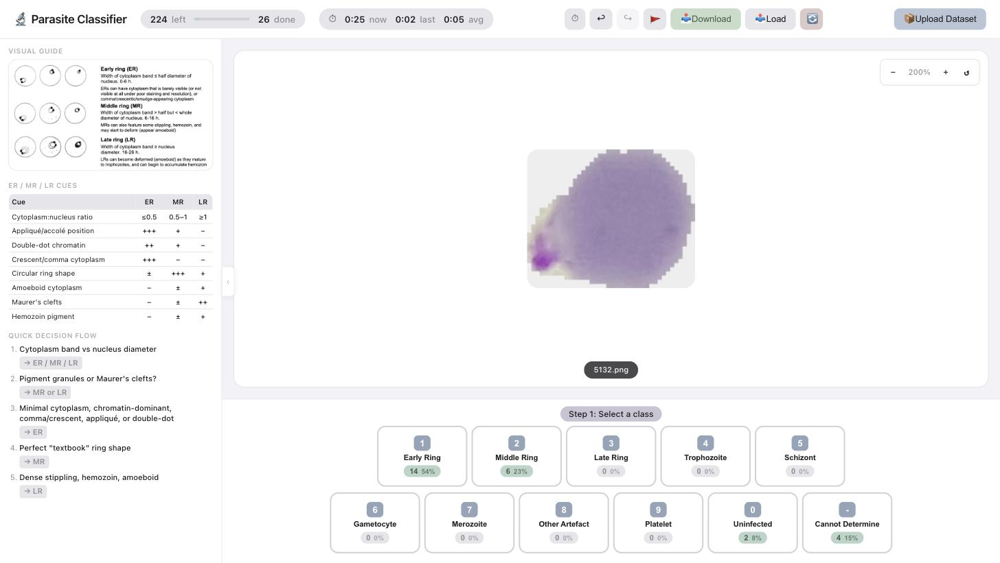

# 🔬 Parasite Classifier

A fast, keyboard-driven web app for hand-labelling microscopy images of malaria parasites. Upload a ZIP of cell images, sort each one into its life-cycle stage with a single keypress, and download a tidy CSV of your labels.

**▶️ Live app: [parasite-sorter-pro.onrender.com](https://parasite-sorter-pro.onrender.com/)**



---

## What it does

You're staring at hundreds of blood-smear crops that each need a label. This app makes that as painless as possible:

- **Upload a ZIP** of images and start immediately — a built-in visual guide and decision cheat-sheet sit right beside the viewer.
- **Classify with the number keys.** Each of the 11 classes is a keypress (`1`–`0`, `-`). Most images take one tap.
- **Zoom, pan, undo, redo, flag** — everything you'd want when a call is hard.
- **Save and resume.** Download progress as a CSV mid-session and re-upload it later to pick up where you left off.
- **Track your pace.** Live timer shows current / last / average time per image, plus a running per-class breakdown.

Everything is per-session and in-memory: your images live in a temporary folder that's cleaned up automatically after 2 hours of inactivity.

## The classes

| Key | Class | | Key | Class |
|-----|-------|-|-----|-------|
| `1` | Early Ring | | `7` | Merozoite |
| `2` | Middle Ring | | `8` | Other Artefact |
| `3` | Late Ring | | `9` | Platelet |
| `4` | Trophozoite | | `0` | Uninfected |
| `5` | Schizont | | `-` | Cannot Determine |
| `6` | Gametocyte | | | |

## How labelling works

Each image goes through a short, mostly one-tap flow:

1. **Pick a class** (`1`–`0`, `-`).
2. **Pick an alternative** (optional) — for the ambiguous ring stages the app suggests the neighbouring class ("Early Ring, or possibly Middle Ring"). This second choice is filed separately so it never inflates your primary counts.
3. **Rate the image quality** — *Usable*, *Limited*, or *Unusable*.

Two shortcuts keep it quick: **Uninfected** (`0`) files as *Usable* in one keypress, and **Cannot Determine** (`-`) skips straight to the quality step.

Behind the scenes each labelled image is copied into `sorted/<Class>/<Quality>/`, so the output folder structure *is* your dataset.

## Keyboard shortcuts

| Key | Action |
|-----|--------|
| `1`–`0`, `-` | Select class / alternative |
| `Z` | Undo |
| `Y` | Redo |
| `F` | Flag & skip (sends the image to the back of the queue) |

## Export format

**Download** gives you a CSV — one row per labelled image:

```csv
filename,first_label,second_label,status,is_adjacent,time_spent_sec
5132.png,Early Ring,Middle Ring,Usable,Yes,4.3
```

`is_adjacent` records whether the alternative was a neighbouring stage (a soft disagreement) vs. a jump (a real one). Re-upload this CSV via **Load** to restore a session onto the same image set.

## Running it locally

```bash
pip install -r requirements.txt
python app.py          # http://localhost:5002
```

Or with gunicorn, the way it runs in production:

```bash
gunicorn app:app
```

## How it's built

Plain Flask + vanilla JS, no build step, no database.

```
app.py              # Flask entry point
routes.py           # HTTP endpoints (upload, classify, undo, save, …)
file_handler.py     # the sorting engine: ZIP extract, classify, undo/redo, CSV
session_manager.py  # per-user in-memory session + temp-folder lifecycle
config.py           # class map, adjacency, quality statuses — one source of truth
utils.py            # small helpers (file listing, counts, coercion)
templates/index.html
static/app.js       # the 3-step selection flow, zoom, timer, keybindings
static/style.css
test_sorter.py      # pytest coverage for the sorting engine
render.yaml         # Render deployment config
```

The class tables in `config.py` are injected into the page as JSON, so the browser and server never disagree about what the labels mean. Run the tests with:

```bash
pytest
```
